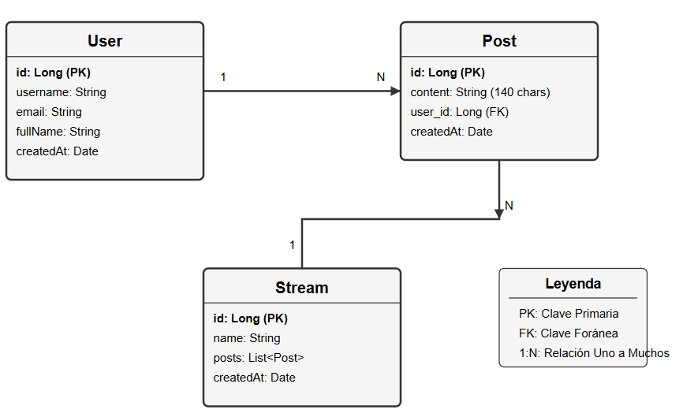
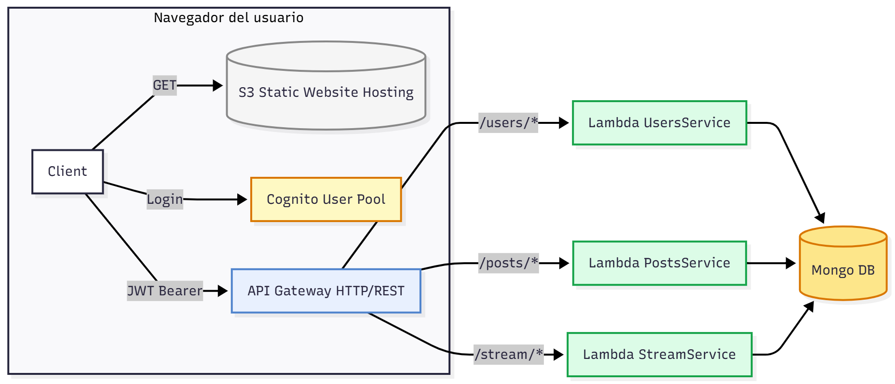

# AREP - Taller 7: Microservicios

## Tabla de Contenidos

- [Descripción del Proyecto](#-descripción-del-proyecto)
- [Arquitectura del Sistema](#️-arquitectura-del-sistema)
- [Seguridad](#-seguridad)
- [API Endpoints](#-api-endpoints)
- [Modelo de Datos](#️-modelo-de-datos)
- [Despliegue](#-despliegue)
- [Frontend](#-frontend)
- [Funcionalidades Principales](#-funcionalidades-principales)
- [Arquitectura de Microservicios](#️-arquitectura-de-microservicios)
- [Video Demostrativo](#-video-demostrativo)

## Descripción del Proyecto

En este taller, se crea una aplicación inspirada en Twitter que permite a los usuarios publicar mensajes de máximo 140 caracteres en un stream global. La aplicación está implementada como una arquitectura de microservicios desplegada en AWS Lambda, con autenticación mediante AWS Cognito, almacenamiento en MongoDB Atlas y alojamiento de archivos estáticos en S3.


## Arquitectura del Sistema

La aplicación está compuesta por tres microservicios independientes:

1. **users-lambda**: Gestiona la creación y consulta de usuarios
2. **posts-lambda**: Maneja la creación y listado de posts
3. **streams-lambda**: Administra los streams (hilos) globales

### Diagrama de entidades



#### Modelo de Datos

* Usuario
    ```json
    {
    "_id": "ObjectId",
    "id": "string (hex representation)",
    "username": "string",
    "email": "string"
    }
    ```

* Post
    ```json
    {
    "_id": "ObjectId",
    "id": "string (hex representation)",
    "streamId": "ObjectId",
    "userId": "string",
    "content": "string (max 140 chars)",
    "createdAt": "ISO 8601 date string"
    }
    ```

* Stream
    ```json
    {
    "_id": "ObjectId",
    "id": "string (hex representation)",
    "name": "global",
    "createdAt": "ISO 8601 date string"
    }
    ```

### Diagrama de arquitectura



- **Backend**: Java 21 + AWS Lambda
- **Base de Datos**: MongoDB Atlas
- **Autenticación**: AWS Cognito con JWT
- **API Gateway**: AWS API Gateway para autorización
- **Frontend**: HTML, JavaScript, Tailwind CSS
- **Hosting**: AWS S3 

#### Ventajas de la Arquitectura

- **Escalabilidad Independiente**: Cada microservicio puede escalar por separado
- **Despliegue Independiente**: Cambios en un servicio no afectan a los otros
- **Falla Aislada**: Si un servicio falla, los demás continúan funcionando
- **Tecnología Flexible**: Cada servicio puede usar diferentes tecnologías

#### Comunicación entre Servicios

Los microservicios se comunican mediante **síncronas HTTP/REST**:

- Cuando `CreatePostHandler` recibe una petición, valida primero con el servicio de usuarios
- También verifica que el stream global exista consultando el servicio de streams
- Esto garantiza la consistencia de datos entre servicios

#### Funcionalidades Principales

1. **Crear Usuario**: Registro de nuevos usuarios en el sistema
2. **Autenticación**: Login seguro con AWS Cognito
3. **Crear Post**: Publicar mensajes de hasta 140 caracteres
4. **Ver Feed**: Visualizar todos los posts en el stream global
5. **Gestión de Stream**: Inicialización automática del stream global


#### Patrones Implementados

- **API Gateway Pattern**: Punto único de entrada para todos los servicios
- **JWT Token Pattern**: Tokens stateless para autenticación
- **Service-to-Service Communication**: Comunicación HTTP entre microservicios
- **Backend for Frontend (BFF)**: API Gateway actúa como BFF

## Seguridad

### Implementación de JWT con AWS Cognito

La aplicación utiliza **AWS Cognito** para la autenticación de usuarios mediante JWT (JSON Web Tokens):

- **Proveedor**: AWS Cognito User Pool
- **Autorización en API Gateway**: Los tokens JWT emitidos por Cognito son validados automáticamente por API Gateway antes de que las solicitudes lleguen a las funciones Lambda
- **Header de Autorización**: Todas las peticiones incluyen `Authorization: Bearer <token>` obtenido de Cognito


### Configuración de Cognito

```javascript
{
  authority: "https://cognito-idp.us-east-1.amazonaws.com/us-east-1_g6UrAa1iK",
  client_id: "7mndnr2bt6r298bvog1c0snfml",
  redirect_uri: "http://microtwitter-taller7.s3-website-us-east-1.amazonaws.com", 
  response_type: "code",
  scope: "openid email"
}
```

### API Gateway Integration

- **Autorizador**: API Gateway utiliza un autorizador Cognito User Pool
- **Validación**: Las peticiones son interceptadas por API Gateway y validadas antes de llegar a Lambda
- **Token Bearer**: El token JWT se valida contra el User Pool configurado en Cognito
- **Respuesta sin token**: Las peticiones sin token válido reciben 401 Unauthorized

### Ejemplo de Validación en Lambda

En el código de las funciones Lambda (ej: `CreatePostHandler.java`), el header de autorización se extrae así:

```java
String authHdr = null;
if (event.getHeaders() != null) {
    var h = event.getHeaders();
    authHdr = h.getOrDefault("Authorization",
            h.getOrDefault("authorization",
                    h.getOrDefault("AUTHORIZATION", null)));
}
if (authHdr == null || authHdr.isBlank()) {
    return ApiResponses.bad("Missing Authorization header");
}
// El token se pasa en solicitudes HTTP a otros servicios
```

Este token validado por API Gateway se usa para:
1. Verificar la identidad del usuario
2. Pasar el token en llamadas HTTP a otros microservicios
3. Mantener el contexto de seguridad a través de la arquitectura

## API Endpoints

### Users Service
- `POST /users` - Crear un nuevo usuario
- `GET /users/{id}` - Obtener información de un usuario específico

### Posts Service  
- `POST /posts` - Crear un nuevo post 
- `GET /posts` - Listar posts del stream global 
  - Query params: `stream` (por defecto "global"), `limit` (por defecto 20)

### Streams Service
- `GET /streams/global` - Obtener información del stream global
- `POST /streams/global/init` - Inicializar el stream global

### URL Base
```
https://o8dquugs9e.execute-api.us-east-1.amazonaws.com/beta
```

## Autorización

Todas las peticiones protegidas requieren el header:

```
Authorization: Bearer <jwt_token_from_cognito>
```


## Instalación

### Prerrequisitos

- Cuenta de AWS con acceso a:
  - Lambda
  - API Gateway
  - Cognito
  - S3
- MongoDB Atlas account
- Java 21
- Maven 3.6+
- AWS CLI configurado

### Pasos

1. **Clonar el repositorio**
   ```bash
   git clone https://github.com/[tu-repo]/arep-taller7.git
   cd arep-taller7
   ```

2. **Compilar las funciones Lambda**
   ```bash
   cd users-lambda && mvn clean package
   cd ../posts-lambda && mvn clean package
   cd ../streams-lambda && mvn clean package
   ```

3. **Desplegar en AWS**
   - Crear funciones Lambda en AWS Console
   - Subir los archivos `.jar` generados
   - Configurar variables de entorno
   - Configurar API Gateway
   - Configurar autorizadores Cognito

4. **Desplegar frontend**
   - Subir carpeta `static/` a S3
   - Configurar bucket policies

### Ejemplo de Uso

1. Accede a la aplicación web en S3
2. Haz clic en "Iniciar Sesión"
3. Inicia sesión con tus credenciales de Cognito
4. Crea un usuario si es necesario
5. Publica posts de hasta 140 caracteres
6. Visualiza el feed global con todos los posts

## Despliegue

### Variables de Entorno Lambda

Cada función Lambda requiere las siguientes variables de entorno:

```bash
MONGODB_URI= # URI de conexión a MongoDB Atlas
DB_NAME=arep  # Nombre de la base de datos
USERS_BASE_URL= # URL del servicio de usuarios (para posts-lambda)
STREAMS_BASE_URL= # URL del servicio de streams (para posts-lambda)
```

### Configuración de API Gateway

1. **Crear un REST API** en API Gateway
2. **Configurar el Autorizador** usando Cognito User Pool
   - Tipo: COGNITO_USER_POOLS
   - User Pool ARN: ARN del User Pool creado en Cognito
   - Token Source: Authorization (header)
   - Token Validation: Use Authorization header
3. **Configurar los recursos y métodos**:
   - `/users` (POST) 
   - `/users/{id}` (GET) 
   - `/posts` (GET, POST) 
   - `/streams/global` (GET) 
   - `/streams/global/init` (POST) 
4. **Asignar el Autorizador** a los métodos que requieren autenticación
5. **Configurar CORS** para permitir peticiones desde el frontend
6. **Desplegar** la API en un stage (beta/prod)


### Frontend en S3

1. **Crear un Bucket S3** con acceso público de lectura
2. **Subir los archivos** del directorio `static/`
3. **Configurar CORS** para permitir peticiones desde el dominio
4. **Configurar bucket policies** para permitir acceso público de lectura como el que se muestra a continuación:

```
{
    "Version": "2012-10-17",
    "Statement": [
        {
            "Sid": "PublicReadForStaticWebsite",
            "Effect": "Allow",
            "Principal": "*",
            "Action": "s3:GetObject",
            "Resource": "arn:aws:s3:::microtwitter-taller7/*"
        }
    ]
}
```


### Configuración de Cognito

1. **Crear User Pool** en AWS Cognito
2. **Configurar el App Client**:
   - Habilitar "Authorization code grant"
   - Configurar callback URLs
   - Habilitar los scopes necesarios (openid, email)
3. **Configurar Domain** para el sign-in UI
4. **Obtener los parámetros** necesarios para el frontend:
   - User Pool ID
   - App Client ID
   - OAuth Domain

## Pruebas

### Colección de Postman

Se incluye una colección de Postman (`AREP-Taller7 API Tests.postman_collection.json`) con ejemplos de todas las peticiones API.

### Endpoints de Prueba

Para probar sin frontend, puede usar curl:

```bash
# Crear usuario
curl -X POST https://o8dquugs9e.execute-api.us-east-1.amazonaws.com/beta/users \
  -H "Content-Type: application/json" \
  -d '{"username":"testuser","email":"test@example.com"}'

# Obtener posts (requiere token)
curl -X GET https://o8dquugs9e.execute-api.us-east-1.amazonaws.com/beta/posts \
  -H "Authorization: Bearer <your_jwt_token>"
```

## Frontend

### Características

- **Interfaz moderna**: Diseño inspirado en Twitter usando Tailwind CSS
- **Autenticación**: Login con AWS Cognito
- **Post en tiempo real**: Actualización automática del feed
- **Validación**: Contador de caracteres con límite de 140
- **UX**: Barra de progreso circular para visualizar caracteres restantes

### Flujo de Autenticación

1. Usuario hace clic en "Iniciar Sesión"
2. Redirige a AWS Cognito Hosted UI
3. Usuario se autentica (email/password)
4. Cognito redirige de vuelta con código de autorización
5. Frontend intercambia código por tokens JWT
6. Tokens se almacenan en localStorage
7. Peticiones API incluyen el token en Authorization header

## Reporte de Pruebas

### Video Demostrativo


## Equipo

* Jorge Andrés Gamboa
* Jaider David Vargas
* Andrea Camila Torres


## 🔗 Referencias

- [AWS Lambda](https://aws.amazon.com/lambda/)
- [AWS Cognito](https://aws.amazon.com/cognito/)
- [API Gateway](https://aws.amazon.com/api-gateway/)
- [MongoDB Atlas](https://www.mongodb.com/cloud/atlas)
- [Postman](https://www.postman.com/)


